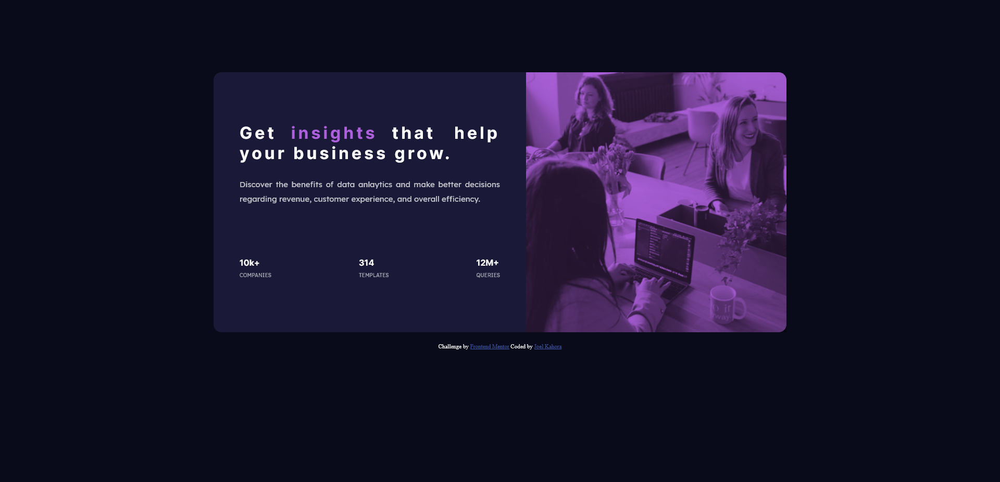

# Frontend Mentor - Stats Preview Card component solution

This a solution to the [Stats preview card component challenge on Frontend Mentor](https://www.frontendmentor.io/challenges/stats-preview-card-component-8JqbgoU62). Frontend Mentor challenges help you improve your coding skills by building realistic projects.

## Table of Contents

- [Overview](#overview)

    -[The Challenge](#the-challenge)

    -[ScreenShot](#screenshot)

    -[Links](#links)

- [My process](#my-process)

    -[Built with](#built-with)

    -[What I learned](#what-i-learned)

    -[Continued Development](#continued-development)

    -[Useful resources](#useful-resources)

-[Author](#author)

-[Acknowledgments](#acknowledgements)

## Overview

### The challenge

Users Should be able to:

- View the optimal layout depending on their device's screen size

### Screenshot




### Links

-Solution URL: [Frontend Mentor Solution](https://github.com/Joekahora/stats-preview-card)

-Live Site URL: [Live site URL](https://joekahora.github.io/stats-preview-card)

## My Process

### Built with

-Semantic HTML5 markup

-CSS custom properties

-Flexbox

-Mobile-first workflow

### What I learned
- Learnt to use flex to layout my elements the way the design demands.

- Learnt to use the mix-blend-mode css property to set how my background color and my image overlay to blend well together.
  In-order to mix them well  I used this code.

  ``` html
  <section id="image-wrapper">
      <div id="image-section" role="img" aria-roledescription="analytics members">
  </section>
  ```
  ```css
  #image-wrapper{
      background-color: #ad60dc;
      height: 300px;
      width: auto;
      border-radius: 15px 15px 0 0;
  }

  #image-section{
      background-image: url("./images/image-header-mobile.jpg");
      background-size: cover;
      background-position: center;
      background-repeat: no-repeat;
      mix-blend-mode: multiply;
      opacity: 0.8;
      height: 100%;
      width: auto;
  }

### Continued development
- To learn more about positions such as relative and absolute 

- To learn more about units such as rem, em, vh, vw and where it is appropriate to use them 

- Media Queries breakpoints

### Useful resources

- [MDN](https://developer.mozilla.org/en-us/docs/Web/CSS/mix-blend-mode) Helped me understand how to use mix blend mode and its various attributes

- [w3schools](https://www.w3schools.com/cssref/css3_pr_flex.asp) Helped me understand more on css flex and its properties.

## Author
- Github - [Joekahora](https://github.com/Joekahora)
- Frontend Mentor - [@JoeKahora](https://frontendmentor.io/profile/Joekahora)

## Acknowledgements
- I would like to say thank you to 
    - <b> Grace snow </b> from the frontend mentor slack channel for her previous answered queries from the "help" group that helped me steer to the right direction and also the following mentors from frontend mentors website community feedback for their feedback on my project solution.
    - [Chamunorwa Mutezva](https://frontendmentor.io/profile/ChamuMutezva)   
    - [Ahmed Faisal](https://frontendmentor.io/profile/afrussel) 
    - [Patrick](https://frontend.io/profile/palgramming)